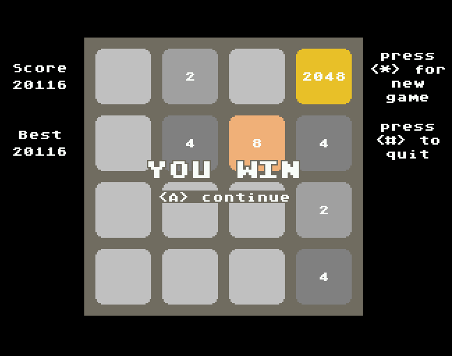

# jag2048
A 2048 game for the ATARI Jaguar.

The game is a clone of [2048 by gabrielecirulli](https://github.com/gabrielecirulli/2048).

## Build
It can be build with the vbcc/vasm/vlink tool chain and the ATARI Jaguar target. You will need node.js to transform the include images into the ATARI JAGUAR raw format.

A `Makefile` is included.
* `make` loads the required node modules (if required) and compiles and links the sources.
* `make runvj` builds all and uploads the binary `jag2048.jag` to virtualjaguar  (virtualjaguar should be in your PATH environment).
* `make runskunk` builds all and uploads the binary `jag2048.jag` to your skunkboard.

## Screenshot
